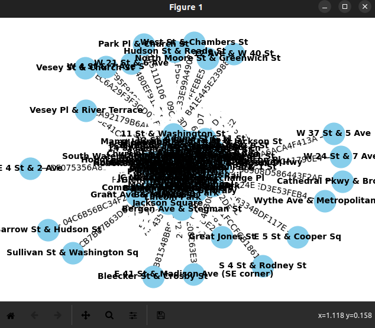
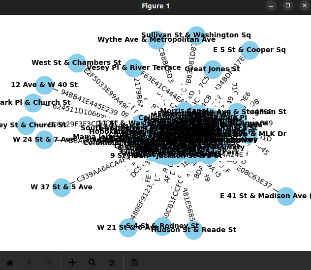

# Projet DMB - MovieLens

## Quel est l'objectif du projet ?

L'objectif du projet est de réaliser un graphe représentant où les noeuds sont des Stations et les chemins des Trips entre ces Stations.
Le jeu de données est tiré issue de : https://s3.amazonaws.com/tripdata/JC-202112-citibike-tripdata.csv.zip

## Modéliser un graphe en Python

Etant donné que j'ai commencé ces séances de TP sur la base de Python, j'ai souhaité poursuivre avec ce langage. Cependant GraphX a peu de compatibilité avec Python par défaut. Les liaisons entre Python et GraphX sont retardées de plusieurs versions, ça attend généralement derrière l'API de Java. Il aurait fallu downgrade Spark, ce qui signifie reprendre à zéro le processus long d'installation.

À la place, je me suis tourné vers GraphFrames : https://github.com/graphframes/graphframes qui wrap les algorithmes de Graph X sous l'API DataFrames et fournit une interface Python.

Ce qui aurait pu paraître simple s'est avéré au contraire plutôt fastidieux. En effet, après quelques tentatives d'utilisation, nous nous retrouvons rapidement avec des erreurs java.lang.ClasNotFoundException: org.graphframes.GraphFramePythonAPI, dû à des lectures de jar manquants.

Heureusement des solutions existent pour intégrer les jar à la main, en récupérant la bonne version en fonction de notre Spark (tiré de : https://stackoverflow.com/questions/39261370/unable-to-run-a-basic-graphframes-example):

```bash
get http://dl.bintray.com/spark-packages/maven/graphframes/graphframes/0.3.0-spark2.0-s_2.11/graphframes-0.3.0-spark2.0-s_2.11.jar

pyspark --packages graphframes:graphframes:0.3.0-spark2.0-s_2.11 --jars graphframes-0.3.0-spark2.0-s_2.11.jar

cp /root/.ivy2/jars/* 

pyspark --packages graphframes:graphframes:0.3.0-spark2.0-s_2.11 --jars graphframes-0.3.0-spark2.0-s_2.11.jar
```

Nous sommes maintenant capables d'utiliser l'équivalent de GraphX qui fournit à la fois les fonctionnalités de GraphX ​​et des fonctionnalités étendues tirant parti de Spark DataFrames, tout ça adapté pour Python.

## Le jeu de données - Question 1.1

En récupant le header du CSV, nous remarquons que les colonnes sont : ride_id (0), rideable_type (1), started_at (2), ended_at (3), start_station_name (4), start_station_id (5), end_station_name (6), end_station_id (7), start_lat (8), start_lng (9), end_lat (10), end_lng (11), member_casual (12)

À partir de là, j'ai pu séparer les attributs pour constituer le dataframe des Stations, et celui des Trips, en prenant soin de nettoyer les données au passage en enlevant celles avec id/nom manquant pour les Stations et src/dst pour les Trips, et en renommant certaines colonnes pour un usage plus simples dans mes futures fonctions :

```python
df = spark.read.csv("JC-202112-citibike-tripdata.csv", header=True)

start_stations = df.select(
    col("start_station_id").alias("id"),
    col("start_station_name").alias("name"),
    col("start_lat").alias("latitude"),
    col("start_lng").alias("longitude")
)

start_stations = start_stations.dropna(subset=["id", "name"])

end_stations = df.select(
    col("end_station_id").alias("id"),
    col("end_station_name").alias("name"),
    col("end_lat").alias("latitude"),
    col("end_lng").alias("longitude")
)

end_stations = end_stations.dropna(subset=["id", "name"])

station_vertices = start_stations.union(end_stations).dropDuplicates(["id"])

trip_edges = df.select(
    col("ride_id").alias("id"),
    col("rideable_type"),
    col("started_at"),
    col("ended_at"),
    col("start_station_id").alias("src"),
    col("end_station_id").alias("dst")
)

trip_edges = trip_edges.dropna(subset=["src", "dst"])
```
## L'affichage des données - Question 1.2

Pour l'affichage du graphe, j'ai dû employer networkx qui est une bibliothèque spécialisée pour l'étude des graphes et des réseaux.

La fonction codée pour l'avantage est alors :

```python
def PlotGraph(edge_list, vertices):
    Gplot = nx.Graph()
    id_to_name = {row['id']: row['name'] for row in vertices.select('id', 'name').collect()}
    for row in edge_list.select('src', 'dst', 'id').collect():
        Gplot.add_edge(id_to_name.get(row['src'], 'unknown'), id_to_name.get(row['dst'], 'unknown'), label=row['id'])
    pos = nx.spring_layout(Gplot)
    nx.draw(Gplot, pos, with_labels=True, font_weight='bold', node_size=700, node_color='skyblue', font_size=10, font_color='black')
    labels = nx.get_edge_attributes(Gplot, 'label')
    nx.draw_networkx_edge_labels(Gplot, pos, edge_labels=labels)
    plt.show()
```



## Sous-graphe - Question 2.1

Tout d'abord il est important de noter la fonction date_to_milliseconds(date_str). Cette fonction convertit une date donnée sous forme de chaîne de caractères en millisecondes depuis l'époque Unix (1er janvier 1970). Elle prend en compte deux formats de date : "YYYY-MM-DD HH:MM:SS" et "DD-MM-YYYY", qui sont des formats que nous pouvons retrouver dans le dataset, ou bien un format utilisé lorsque la fonction est appelée (parce qu'on n'ira pas jusqu'à détailler les secondes en règle générale).

Cette question est représentée par la fonction get_subgraph(start_date, end_date, graph). Cette fonction crée un sous-graphe à partir d'un graphe existant, en se basant sur une plage de dates spécifiée. Elle fonctionne ainsi :

- Elle convertit les dates de début et de fin fournies en millisecondes depuis l'époque Unix en utilisant la fonction date_to_milliseconds.
- Elle transforme les arêtes du graphe en un RDD, puis elle applique une fonction map pour créer un nouvel objet Row pour chaque arête. Chaque objet Row contient les attributs src, dst, id, started_at et ended_at. Les attributs started_at et ended_at sont convertis en millisecondes.
- Elle transforme l'RDD en un dataframe.
- Elle filtre les arêtes du dataframe pour ne garder que celles dont le started_at est supérieur ou égal à start_ms et le ended_at est inférieur ou égal à end_ms, c'est là où la conversion a son utilité.
Elle crée un nouveau GraphFrame en utilisant les sommets du graphe original et les arêtes filtrées.
- Elle retourne le sous-graphe avec les bons trajets qui existent entre ces dates.

Pour répondre à la question : "Extrayez le sous-graphe dont les intervalles temporelles de ces trajets existent entre 05-12-
2021 et 25-12-2021." Nous appelons la fonction avec :

```python
get_subgraph("05-12-2021", "25-12-2021", graph)
```

Le graphe est ensuite créé, il est possible de l'afficher comme pour la question 1.2



## Les 10 stations avec le plus de trajets sortants/entrants - Question 2.2

Pour cette question, on se base sur la fonction compute_top_stations(graph). Cette fonction calcule le top 10 des stations pour en fonction des Trips entrants et sortants. Elle fonctionne ainsi :

- Elle groupe les arêtes du graphe par destination (dst), compte le nombre d'arêtes pour chaque groupe, et ordonne les groupes par ce nombre en ordre décroissant. Elle stocke le résultat dans incoming_trips.
- Elle fait de même pour les arêtes groupées par source (src) et stocke le résultat dans outgoing_trips.
- Elle affiche les 10 premières entrées de incoming_trips et outgoing_trips.

Le résultat obtneu est :

Top 10 stations for incoming trips:
+-----+-----+                                                                   
|  dst|count|
+-----+-----+
|JC005| 2375|
|HB102| 2026|
|HB101| 1677|
|JC056| 1518|
|JC009| 1352|
|HB105| 1296|
|HB103| 1296|
|JC066| 1261|
|JC008| 1206|
|JC105| 1126|
+-----+-----+

Top 10 stations for outgoing trips:
+-----+-----+
|  src|count|
+-----+-----+
|JC005| 2355|
|HB102| 2111|
|JC056| 1670|
|HB101| 1640|
|JC066| 1298|
|JC009| 1290|
|HB105| 1242|
|HB103| 1233|
|JC008| 1206|
|JC013| 1087|
+-----+-----+

## Station la plus proche d'une autre (distance) - Question 3.1

Tout d'abord il est important de noter que cette question se base sur la fonction haversine(lon1, lat1, lon2, lat2). Cette fonction calcule la distance en kilomètres entre deux points géographiques donnés en longitude et latitude en utilisant la formule de Haversine. Elle fonctionne ainsi :

- Elle convertit les longitudes et latitudes données en radians.
- Elle calcule la différence de longitude et de latitude entre les deux points.
- Elle utilise ces différences pour calculer la distance entre les deux points en utilisant la formule de Haversine.
- Elle retourne la distance calculée.

À partir de cette fonction, j'ai pu définir haversine_udf = udf(haversine, FloatType()) qui crée une fonction UDF pour la fonction haversine qui peut être utilisée avec des dataframes de PySpark.

Cette question se base sur la fonction nearest_station_distance(graph, station_id). Cette fonction trouve la station la plus proche en termes de distance de la station donnée. Elle fonctionne ainsi :

- Elle récupère la longitude et la latitude de la station donnée dans ses attributs.
- Elle calcule la distance entre la station donnée et toutes les autres stations en utilisant l'UDF haversine, et ajoute cette distance comme une nouvelle colonne au dataframe des sommets.
- Elle filtre la station donnée du dataframe.
- Elle ordonne les sommets par distance et retourne le premier sommet.

Pour répondre à la question : "Trouvez et affichez la station la plus proche de la station JC013 tel que la distance du trajet
entre les deux stations soit minimale." Le résultat obtenu est le suivant :

"The nearest station from JC013 in terms of distance is JC003."

## Station la plus proche d'une autre (temps) - Question 3.2

Cette question se base sur la fonction nearest_station_time(graph, station_id). Cette fonction trouve la station la plus proche en termes de temps de la station donnée. Elle fonctionne ainsi :

- Elle transforme les arêtes du graphe en un RDD.
- Elle applique une fonction map à l'RDD pour créer un nouvel objet Row pour chaque arête. Chaque objet Row contient les attributs src, dst, id, et time. L'attribut time est calculé en soustrayant le started_at du ended_at pour chaque arête, après avoir converti ces temps en millisecondes.
- Elle transforme l'RDD en un dataframe.
- Elle filtre les arêtes du dataframe pour ne garder que celles qui ont la station donnée comme source ou destination.
- Elle groupe les arêtes par destination et trouve le temps minimum pour chaque groupe.
- Elle filtre la station donnée des résultats.
- Elle ordonne les groupes par temps et retourne la première entrée.

Pour répondre à la question : "Trouvez et affichez la station la plus proche de la station JC013 tel que la durée du trajet (relation)
entre les deux stations soit minimale." Le résultat obtenu est le suivant :

"The nearest station from JC013 in terms of time is JC003." Exactement pareil qu'à la question précédente donc.

## Conclusion

Ce TP était une très bonne introduction à la gestion des graphes pour des gros jeux de données. Malgré des complications liées à Spark, les questions étaient suffisamment poussées pour nous pousser à retravailler notre structure de données initiales pour correspondre avec les attentes (format des timestamp, le calcul des distances avec la formule de haversine pour déterminer la distance entre deux points d'une sphère, à partir de leurs longitudes et latitudes pour s'adapter au fait que la méthode getDistKilometers ne soit appelable ici).