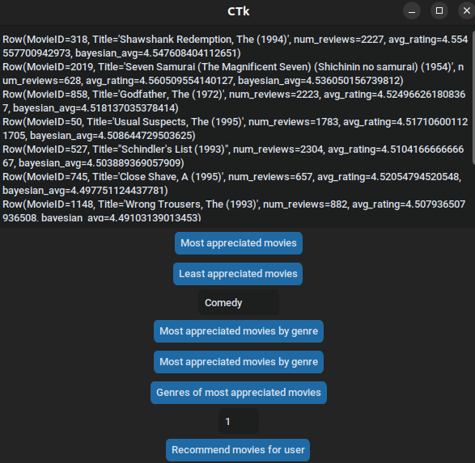

# Projet DMB - MovieLens

## Quel est l'objectif du projet ?

Qui n'a jamais été tenté de jeter un coup d'oeil aux critiques d'un film pour éviter de perdre son temps devant un navet ?
Ce projet s'inscrit dans l'univers riche et dynamique des critiques de films en utilisant les données fournies par MovieLens. MovieLens, une plateforme collaborative de recommandation de films, offre une collection diversifiée de critiques, de notations, et de données démographiques associées. Notre objectif ici est donc d'explorer ces données, de les analyser et d'extraire des insights significatifs qui peuvent permettre de desceller des tendances.

## Un point à noter

Bien que je sois parti sur MovieLens, mon idée initiale était de trouver un équivalent pour les jeux vidéos. Pour ça, j'avais concentré mes recherches autour de Steam, une plateforme de distribution de contenu en ligne, mais les jeux de données trouvés n'étaient pas à la hauteur des mes espérances. 

Celui qui est le mieux noté sur Kaggle est le suivant : https://www.kaggle.com/datasets/nikdavis/steam-store-games malheureusement il se concentre essentiellement sur les différents jeux de la plateforme, et non les avis sur ces jeux.

Et pour ce qui est des jeux de données autour des reviews Steam, celui qui est le plus mis en avant est le suivant : https://www.kaggle.com/datasets/andrewmvd/steam-reviews le souci étant ici que les reviews sont anonymisées, nous pouvons donc seulement savoir le jeu lié à une review, le contenu de la review, les upvotes de cette review, et le sentiment dégagé (plus intéressant pour de la classification).

J'ai finalement trouvé un jeu de données avec une association review / utilisateur qui a servi pour un travail de recherche en Australie (les joueurs provenaient donc en grande partie d'Australie). Ce jeu était représenté sous la forme d'un JSON hors la structure JSON qui était utilisée comportait de nombreuses erreurs l'empêchant d'être lu. J'ai donc rédigé un script permettant de corriger la structure, et de transférer les données en format CSV : [LIEN DU SCRIPT] / [LIEN DU DATASET]. Comme nous pouvons le remarquer avec le résultat fourni, le jeu de données est relativement "pauvre" puisque, pour le peu de données présentes dans le set, la plupart des reviews sont uniques à des utilisateurs, il est donc très compliqué de faire des parallèles surtout lorsqu'il s'agit de suggérer un jeu pour un utilisateur (sur la base d'un avis nous ne pouvons pas être certain que le jeu soit réellement fait pour lui).

Travail effectué dans le dossier 'Experimental' de 'TP_MiniProj'.

## Le Dataset MovieLens

Le Dataset se situe dans le dossier [LIEN DU DATASET] découpé en trois parties : [LIEN PREMIER], [LIEN DEUXIEME], [LIEN TROISIEME].
Nous nous retrouvons alors avec :

movies_df :
- MovieID
- Title
- Genre

ratings_df :
- UserID
- MovieID
- Rating
- Timestamp

users_df :
- UserID
- Gender
- Age
- Occupation
- zip-code

Que nous découpons ainsi dans le script :

```python
movies_df = spark.read.csv(
    './datasets/movies.dat',
    sep='::',
    header=False,
    inferSchema=True
).toDF('MovieID', 'Title', 'Genres')

movies_df = movies_df.withColumn('Genres', split(col('Genres'), '\|'))

users_df = spark.read.csv(
    './datasets/users.dat',
    sep='::',
    header=False,
    inferSchema=True
).toDF('UserID', 'Gender', 'Age', 'Occupation', 'zip-code')

ratings_df = spark.read.csv(
    './datasets/ratings.dat',
    sep='::',
    header=False,
    inferSchema=True
).toDF('UserID', 'MovieID', 'Rating', 'Timestamp')

ratings_df = ratings_df.withColumn('Timestamp', ratings_df['Timestamp'].cast('timestamp'))
```

À partir de ces différents dataframes, nous constituons un dataframe unique (en effectuant des jointures) avec les informations qui nous intéressent, à savoir :

```python
movie_ratings_df = movies_df.join(ratings_df, on='MovieID')
master_data = movie_ratings_df.join(users_df, on='UserID')
master_data = master_data.select('MovieID', 'Title', 'Genres', 'UserID', 'Age', 'Gender', 'Occupation', 'Rating')
```

## Présentation des informations

Pour une question de confort dans mes phases de test, j'ai ajouté une interface graphique grâce à tkinter, et plus précisément un dérivé qu'est customkinter pour une meilleure UI. Cette interface est définie dans la fonction main et est représentée comme tel :

Pour utiliser correctement l'interface graphique, il est important de noter que pour certaines questions où : un genre ou un id d'utilisateur est nécessaire, il y a des champs spécifiques à remplir manuellement, la plupart du temmps au dessus du bouton lié à la question.

## Les questions autour du dataset

Au cours de ce projet, l'idée était de répondre à quelques questions relatives au jeu de données.
Dans l'odre nous avons :

- les films les plus appréciés - 1 -
- les films les moins appréciés - 2 -
- les films les plus appréciés pour un genre donné - 3 -
- les films les moins appréciés pour un genre donné - 4 -
- les genres les plus appréciés - 5 -
- les films recommandés pour un utilisateur donné - 6 -

Pour 1 et 2, la question pouvait s'avérer être triviale dans un premier temps. En effet, ma toute première implémentation était la suivante :

```python
def find_most_appreciated_movies():
    most_appreciated_movies = master_data.groupBy('MovieID', 'Title').agg({'Rating': 'avg'}).orderBy('avg(Rating)', ascending=False)
    return most_appreciated_movies
```

Cette simple implémentation permet de moyenner les scores des reviews pour chaque film. En disant ça nous pouvons tout de suite comprendre la limite : un film avec 2000+ reviews, dont la moyenne des reviews s'élève à 4.5, sera derrière un film avec une seule review avec un score de 5. J'aurais pu simplement me dire de prendre les films qu'à partir d'un certain nombre de reviews, mais déterminer cette borne inférieure est très subjectif et peut encore présenter des incohérences vis-à-vis du ratio entre le nombre de reviews et le score total. La solution était donc de trouver un compromis entre ces deux métriques, c'est alors qu'intervient la moyenne Bayésienne pour effectuer notre propre ranking. En statistique la moyenne Bayésienne est régie par la formule :
(Prior Belief * Number of Observation + Sum of Observed Values) / Prior Belief + Number of Observation (selon : https://www.algolia.com/doc/guides/managing-results/must-do/custom-ranking/how-to/bayesian-average/).

- Prior Belief représente dans notre cas ce que pourrait être la note moyenne en l'absence de données observées. Il sert de terme de régularisation, influençant la note moyenne pour les éléments avec peu de reviews.
- Number of Observation représente intuitivement le nombre de reviews pour une film.
- Sum of Observed Values représente le score total des reviews pour ce film.

L'idée est que, pour les éléments avec un petit nombre d'observations, la moyenne Bayésienne sera davantage influencée par le Prior Belief fournissant une estimation plus conservatrice. À mesure que le nombre d'observations augmente, la moyenne Bayésienne converge vers la moyenne arithmétique traditionnelle des observations. C'est ainsi que nous en sommes arrivés à l'implémentation actuelle.

Finalement, nous obtenons pour 1 :



Row(MovieID=318, Title='Shawshank Redemption, The (1994)', num_reviews=2227, avg_rating=4.554557700942973, bayesian_avg=4.547608404112651)
Row(MovieID=2019, Title='Seven Samurai (The Magnificent Seven) (Shichinin no samurai) (1954)', num_reviews=628, avg_rating=4.560509554140127, bayesian_avg=4.536050156739812)
Row(MovieID=858, Title='Godfather, The (1972)', num_reviews=2223, avg_rating=4.524966261808367, bayesian_avg=4.518137035378414)
Row(MovieID=50, Title='Usual Suspects, The (1995)', num_reviews=1783, avg_rating=4.517106001121705, bayesian_avg=4.508644729503625)
Row(MovieID=527, Title="Schindler's List (1993)", num_reviews=2304, avg_rating=4.510416666666667, bayesian_avg=4.503889369057909)
Row(MovieID=745, Title='Close Shave, A (1995)', num_reviews=657, avg_rating=4.52054794520548, bayesian_avg=4.497751124437781)
Row(MovieID=1148, Title='Wrong Trousers, The (1993)', num_reviews=882, avg_rating=4.507936507936508, bayesian_avg=4.49103139013453)
Row(MovieID=1198, Title='Raiders of the Lost Ark (1981)', num_reviews=2514, avg_rating=4.477724741447892, bayesian_avg=4.4718700475435815)
Row(MovieID=904, Title='Rear Window (1954)', num_reviews=1050, avg_rating=4.476190476190476, bayesian_avg=4.462264150943396)
Row(MovieID=922, Title='Sunset Blvd. (a.k.a. Sunset Boulevard) (1950)', num_reviews=470, avg_rating=4.491489361702127, bayesian_avg=4.460416666666666)

Et pour 2 nous obtenons :

Row(MovieID=810, Title='Kazaam (1996)', num_reviews=120, avg_rating=1.4666666666666666, bayesian_avg=1.5846153846153845)
Row(MovieID=1495, Title='Turbo: A Power Rangers Movie (1997)', num_reviews=44, avg_rating=1.3181818181818181, bayesian_avg=1.6296296296296295)
Row(MovieID=1739, Title='3 Ninjas: High Noon On Mega Mountain (1998)', num_reviews=47, avg_rating=1.3617021276595744, bayesian_avg=1.6491228070175439)
Row(MovieID=3593, Title='Battlefield Earth (2000)', num_reviews=342, avg_rating=1.6111111111111112, bayesian_avg=1.6505681818181819)
Row(MovieID=1323, Title='Amityville 3-D (1983)', num_reviews=43, avg_rating=1.372093023255814, bayesian_avg=1.679245283018868)
Row(MovieID=2799, Title='Problem Child 2 (1991)', num_reviews=99, avg_rating=1.5555555555555556, bayesian_avg=1.688073394495413)
Row(MovieID=2817, Title='Aces: Iron Eagle III (1992)', num_reviews=125, avg_rating=1.64, bayesian_avg=1.7407407407407407)
Row(MovieID=2383, Title='Police Academy 6: City Under Siege (1989)', num_reviews=149, avg_rating=1.657718120805369, bayesian_avg=1.7421383647798743)
Row(MovieID=3799, Title='Pok�mon the Movie 2000 (2000)', num_reviews=100, avg_rating=1.62, bayesian_avg=1.7454545454545454)
Row(MovieID=3042, Title='Meatballs III (1987)', num_reviews=65, avg_rating=1.5538461538461539, bayesian_avg=1.7466666666666666)

Cette même limite s'est faite ressentir lors des questions 3 et 4. Pour donner un exemple, pour le genre 'Comedy' les 3 premiers films avaient un score de 5 en moyenne. Si nous prenons le second film pour ce genre, qui est 'Smashing Time (1967), nous pouvons récupérer ses reviews dans le jeu de données créé avec 
```python 
print(master_data.filter(col('Title') == 'Smashing Time (1967)').collect())
```
pour obtenir ce résultat : 
[Row(MovieID=3233, Title='Smashing Time (1967)', Genres=['Comedy'], UserID=3428, Age=45, Gender='M', Occupation=1, Rating=5), 
Row(MovieID=3233, Title='Smashing Time (1967)', Genres=['Comedy'], UserID=4038, Age=50, Gender='M', Occupation=6, Rating=5)]

Seulement deux reviews avec un score de 5. J'ai donc repris le même ranking que les questions 1 et 2.
Etant donné que ces questions sont plus poussées, je vais les détailler, c'est sur ce même principe qu'ont été implémentés 1 et 2.
Je commence par filtrer le dataframe master_data pour inclure uniquement les lignes où le genre spécifié est présent dans la colonne 'Genres' puisque jusqu'ici les genres sont représentés comme tel : Comedy|Drama|Romance si le film est une Comedy, Drama et Romance.

```python
most_appreciated_movies_by_genre = master_data.filter(array_contains(col('Genres'), genre))
```

Ensuite, je regroupe les données pour garantir que chaque film unique du genre spécifié est représenté dans le résultat.

```python
most_appreciated_movies_by_genre = most_appreciated_movies_by_genre.groupBy('MovieID', 'Title')
```

Après, j'utilise agg({'Rating': 'avg', 'MovieID': 'count'}) pour calculer la moyenne des évaluations ('avg(Rating)') et le nombre total d'avis pour chaque film ('count(MovieID)').

```python
most_appreciated_movies_by_genre = most_appreciated_movies_by_genre.agg({'Rating': 'avg', 'MovieID': 'count'})
```

Je rename résultantes pour un peu plus de clareté quand j'implémente la fonction, puis j'effectue le processus de calcul de la moyenne Bayésienne comme détaillé plus tôt.
Enfin, je trie les résultats par la moyenne Bayésienne dans l'ordre décroissant pour obtenir les films les mieux notés en premier.

```python
most_appreciated_movies_by_genre = most_appreciated_movies_by_genre.orderBy('bayesian_avg', ascending=False)
```

En considérant le genre 'Comedy'.

J'obtiens alors pour 3 :

Row(MovieID=745, Title='Close Shave, A (1995)', num_reviews=657, avg_rating=4.52054794520548, bayesian_avg=4.497751124437781)
Row(MovieID=1148, Title='Wrong Trousers, The (1993)', num_reviews=882, avg_rating=4.507936507936508, bayesian_avg=4.49103139013453)
Row(MovieID=3030, Title='Yojimbo (1961)', num_reviews=215, avg_rating=4.404651162790698, bayesian_avg=4.342222222222222)
Row(MovieID=3307, Title='City Lights (1931)', num_reviews=271, avg_rating=4.387453874538745, bayesian_avg=4.338078291814947)
Row(MovieID=1223, Title='Grand Day Out, A (1992)', num_reviews=473, avg_rating=4.361522198731501, bayesian_avg=4.333333333333333)
Row(MovieID=1136, Title='Monty Python and the Holy Grail (1974)', num_reviews=1599, avg_rating=4.335209505941213, bayesian_avg=4.326911124922312)
Row(MovieID=2324, Title='Life Is Beautiful (La Vita � bella) (1997)', num_reviews=1152, avg_rating=4.329861111111111, bayesian_avg=4.3184165232358005)
Row(MovieID=2858, Title='American Beauty (1999)', num_reviews=3428, avg_rating=4.3173862310385065, bayesian_avg=4.313554392088424)
Row(MovieID=1234, Title='Sting, The (1973)', num_reviews=1049, avg_rating=4.320305052430887, bayesian_avg=4.307837582625118)
Row(MovieID=3022, Title='General, The (1927)', num_reviews=206, avg_rating=4.368932038834951, bayesian_avg=4.305555555555555)

Et pour 4 :

Row(MovieID=810, Title='Kazaam (1996)', num_reviews=120, avg_rating=1.4666666666666666, bayesian_avg=1.5846153846153845)
Row(MovieID=2799, Title='Problem Child 2 (1991)', num_reviews=99, avg_rating=1.5555555555555556, bayesian_avg=1.688073394495413)
Row(MovieID=2383, Title='Police Academy 6: City Under Siege (1989)', num_reviews=149, avg_rating=1.657718120805369, bayesian_avg=1.7421383647798743)
Row(MovieID=3042, Title='Meatballs III (1987)', num_reviews=65, avg_rating=1.5538461538461539, bayesian_avg=1.7466666666666666)
Row(MovieID=2555, Title='Baby Geniuses (1999)', num_reviews=164, avg_rating=1.701219512195122, bayesian_avg=1.7758620689655173)
Row(MovieID=2382, Title='Police Academy 5: Assignment: Miami Beach (1988)', num_reviews=150, avg_rating=1.7666666666666666, bayesian_avg=1.84375)
Row(MovieID=3268, Title='Stop! Or My Mom Will Shoot (1992)', num_reviews=179, avg_rating=1.782122905027933, bayesian_avg=1.8465608465608465)
Row(MovieID=3041, Title='Meatballs Part II (1984)', num_reviews=73, avg_rating=1.6986301369863013, bayesian_avg=1.855421686746988)
Row(MovieID=3564, Title='Flintstones in Viva Rock Vegas, The (2000)', num_reviews=128, avg_rating=1.8046875, bayesian_avg=1.891304347826087)
Row(MovieID=1760, Title='Spice World (1997)', num_reviews=190, avg_rating=1.8736842105263158, bayesian_avg=1.93)

Maintenant, pour ce qui est de 5, nous n'avons pas besoin d'exploiter la moyenne Bayésienne puisque nous cherchons à chercher les meilleurs genres, et donc toutes les reviews sont importantes à considérer, peu importe le film auquel elle est affiliée (la moyenne Bayésienne serait très similaire à la moyenne arithmétique).
Pour cette question je commence par utiliser la méthode explode pour créer une nouvelle ligne pour chaque genre présent dans la colonne 'Genres' afin de créer un DataFrame élargi où chaque ligne représente un film individuel et son genre correspondant. Je regroupe par genre comme précédemment, je moyenne et nous avons notre résultat :

Row(Genre='Film-Noir', avg(Rating)=4.075187558184108)
Row(Genre='Documentary', avg(Rating)=3.933122629582807)
Row(Genre='War', avg(Rating)=3.893326717935996)
Row(Genre='Drama', avg(Rating)=3.766332232342065)
Row(Genre='Crime', avg(Rating)=3.708678543141273)
Row(Genre='Animation', avg(Rating)=3.684868223500335)
Row(Genre='Mystery', avg(Rating)=3.6681019463387923)
Row(Genre='Musical', avg(Rating)=3.6655189849035708)
Row(Genre='Western', avg(Rating)=3.6377701493980563)
Row(Genre='Romance', avg(Rating)=3.607464598740535)

En considérant l'utilisateur 1.  
Pour la question 6 nous avons un crawling des films similaires aux genres préférés de l'utilisateur  :
Row(MovieID=1193, Title="One Flew Over the Cuckoo's Nest (1975)")
Row(MovieID=2355, Title="Bug's Life, A (1998)")
Row(MovieID=1287, Title='Ben-Hur (1959)')
Row(MovieID=2804, Title='Christmas Story, A (1983)')
Row(MovieID=595, Title='Beauty and the Beast (1991)')
Row(MovieID=1035, Title='Sound of Music, The (1965)')
Row(MovieID=3105, Title='Awakenings (1990)')
Row(MovieID=1270, Title='Back to the Future (1985)')
Row(MovieID=527, Title="Schindler's List (1993)")
Row(MovieID=48, Title='Pocahontas (1995)')